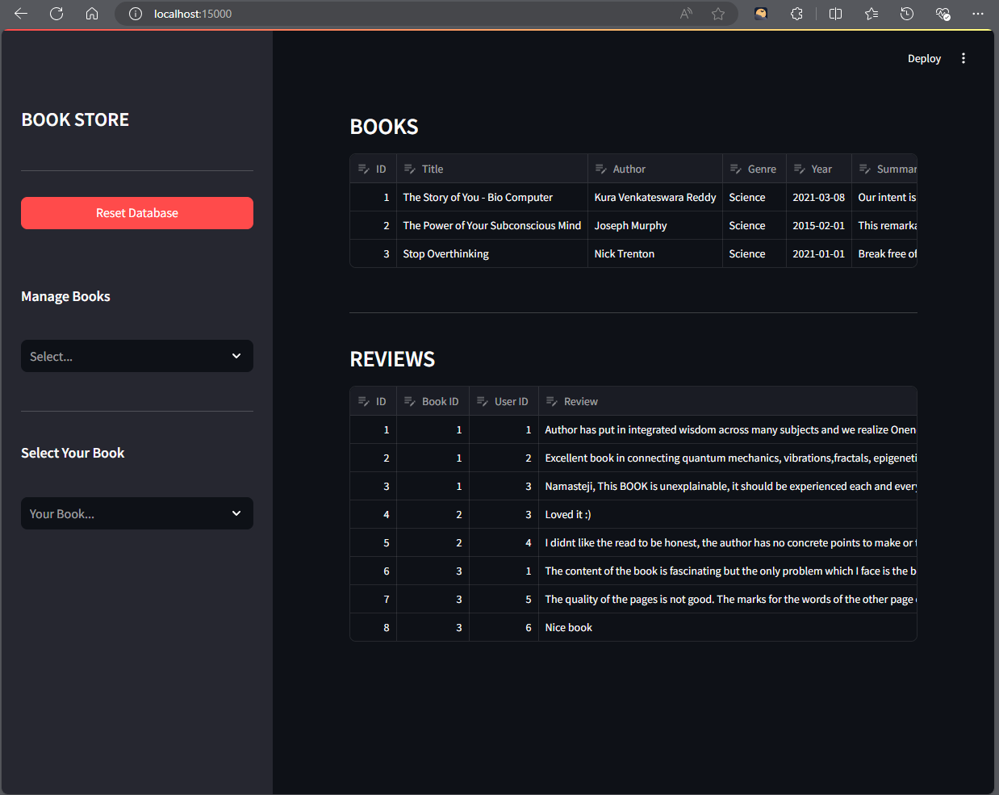

# Book-Management-System
A sample book management system for JKTech assessment.

## Dependencies


## Instructions

*Prerequisites:*
1. git
2. docker
3. gpu - otherwise comment the deploy property in book-manager-app service

```
git clone git@github.com:pranjallk1995/Book-Management-System.git
```
```
cd Book-Management-System; docker compose up
```
open a browser and go to localhost:15000

## Screenshot

